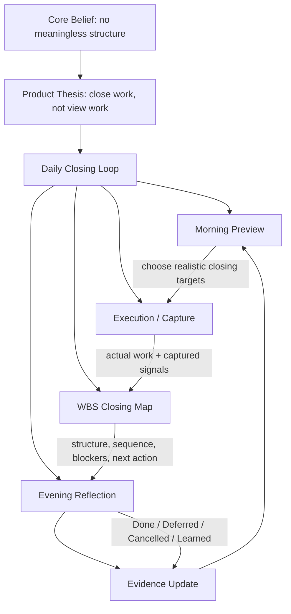
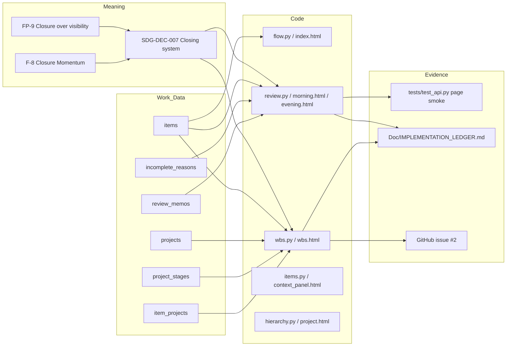
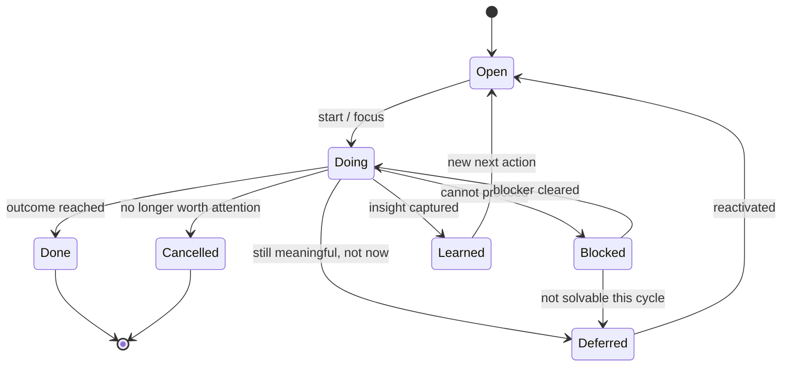
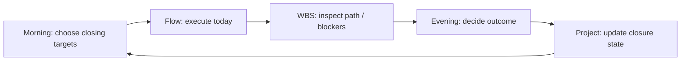
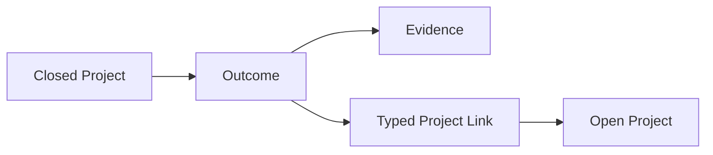

# MissionC Closing Graph Review

This review reorganizes MissionC around the current product philosophy:

> MissionC should help projects close, not merely be viewed.

The review is local-first and repo-internal. It does not delete anything by
itself. It identifies which structures have clear meaning, which need stronger
connection to the closing loop, and which may be unnecessary unless they earn a
clear role.

## 1. Product Meaning Graph

The important shift is that `Flow`, `Calendar`, `Hierarchy`, `WBS`, and
`Review` should not be parallel tabs with equal philosophical weight. They
should become stages or lenses inside a closing loop.

## 2. Current Implementation Graph

Current gap: `review.py` records incomplete reasons, and `wbs.py` displays
project/task timelines, but there is no strong feedback edge from review
outcomes into WBS/project closure. There is also no outcome graph that lets a
closed project feed another open project.

## 3. Closing State Graph

The current schema supports `todo`, `doing`, `done`, `waiting`, and
`cancelled`. It does not yet make `Deferred`, `Blocked`, or `Learned` first-class
closing outcomes. They are partly implied through `waiting`,
`incomplete_reasons.decision`, and review text.

## 4. Capability Meaning Review

| Capability | Current Meaning | Closing Fit | Review |
|------------|-----------------|-------------|--------|
| Flow | Daily work surface. | High | Keep. It should surface today's closing targets, not just today's list. |
| Calendar | Time commitments and external schedule. | High | Keep. It should show schedule pressure against closing targets. |
| Morning Review | Preview of today and carry-over. | High | Promote. It is the opening half of the closing loop. |
| Evening Review | Captures unfinished reasons and decisions. | High | Promote. It should become the main closure accounting surface. |
| WBS | Read-only Gantt-like structure. | High but incomplete | Reframe as closing map: blockers, next actions, overdue sequence, review outcomes. |
| Hierarchy | Organization/business/project structure. | Medium-High | Keep if it helps choose context. Avoid becoming a passive directory. |
| Project Detail | Project context and items. | High | Should show closing status, next closing action, unresolved blockers. |
| Inbox | Safe capture staging area. | Medium-High | Keep. It prevents loss but must feed closing targets quickly. |
| Search | Retrieval. | Medium | Keep if it helps recover context for closure. Avoid over-investing before closing loop works. |
| Diagnostics | Trust and operating state. | Medium | Keep. It supports honest automation. |
| Background Sync | Fresh external context. | Medium | Build only with visible cache/failure/manual-refresh state. |
| Notifications | Time pressure and reminders. | Medium | Keep if it nudges closing, not just noise. |
| Contacts | Meeting/attendee context. | Medium-Low | Keep only if linked to schedules, blockers, or responsible parties. |
| Dashboard | Summary view. | Unclear | Needs meaning test: does it create closing action, or only display metrics? |
| Voice Capture | Fast capture. | Experimental | Keep RnD until it reliably feeds capture/inbox without friction. |
| AI Suggestion | Lightweight classification. | Experimental | Keep only if it reduces classification friction in the closing loop. |
| Radial Palette | Fast navigation/command surface. | Lab only | Keep behind lab toggle until safe. It must not block closing work. |
| Legacy Project Hub | Old implementation / reference. | Low | Archive or remove after confirming no active dependency. |
| Root static folder | Old frontend assets. | Low | Compare references; likely archive/remove if unused by current FastAPI app. |

## 5. Meaningless Structure Test

A MissionC structure earns its place only if it passes at least one of these:

| Test | Question |
|------|----------|
| Closing Test | Does it help an item/project reach Done, Deferred, Cancelled, or Learned? |
| Context Test | Does it connect scattered work into one usable context? |
| Trust Test | Does it make local data, credentials, sync, or failures more understandable? |
| Reflection Test | Does it help the user learn from unfinished work? |
| Evidence Test | Does it create traceable evidence for future decisions? |
| Safety Test | Does it avoid trapping, distracting, or silently failing? |

If a component fails all six tests, it is a cleanup candidate.

## 6. Cleanup / Reframing Candidates

| Candidate | Current Evidence | Risk | Recommendation |
|-----------|------------------|------|----------------|
| `project_hub.py` | Uses old `project_hub.db`; referenced as old pattern in research. | Confuses current product identity. | Mark as legacy or move to an archive after confirming it is unused. |
| Root `static/` | Current app serves `src/core_api/static`; root static appears tied to older app. | Duplicate frontend surface. | Verify references, then archive/remove. |
| Broken UI copy | Several templates display mojibake in shell output and likely in UI if encoded incorrectly. | Undermines trust and product craft. | Audit user-facing labels, especially topbar, review, labels. |
| Dashboard | Exists as a page, but closing role is unclear. | May become passive vanity metrics. | Reframe as "Closure Dashboard" or defer. |
| Contacts | Implemented, but not yet tied to closing. | Another detached database unless linked to meetings/blockers. | Keep only if tied to attendees, owners, blockers, or follow-ups. |
| Voice Capture | Experimental endpoint exists. | Adds complexity before closing loop is strong. | Keep RnD; do not promote yet. |
| AI Suggestion | Heuristic route exists. | Classification can become decorative if not tied to action. | Tie to inbox triage or closing target suggestions only. |
| Radial Palette | Known stuck-overlay issue. | Directly blocks use. | Keep lab-only until issue #1 is fixed. |
| Old phase docs | Valuable history but contain outdated terms and v1/v1.5 framing. | Current truth becomes blurry. | Keep as evidence; make Master Spec + Philosophy + Ledger current truth. |

## 7. Recommended Next Design Move

Do not start with a large UI refactor.

Start by strengthening the closing loop in the smallest useful path:

The next layer is:

Suggested first implementation slice:

1. Define first-class closing outcomes in docs and UI copy.
2. Add WBS page smoke test.
3. Add a project-level "next closing action" concept.
4. Let evening review write decisions that can be surfaced in project/WBS views.
5. Rename or reframe passive labels/screens so they point toward closure.
6. Add an outcome graph later so closed projects can inform open projects.

## 8. Questions For Owner

1. Should `Learned` be a real item/project status, or should it remain a review outcome?
2. Should `Blocked` be separate from current `waiting`, or should `waiting` be renamed/reframed?
3. Should WBS show review outcomes directly, or only show blockers/next actions first?
4. Is `Dashboard` still valuable if it becomes a "Closure Dashboard" rather than a general dashboard?
5. Should `Contacts` represent people as blockers/owners/attendees, or stay as simple address book context?
6. Should a closed project's outcome become a first-class node immediately, or should it start as a project close summary?
