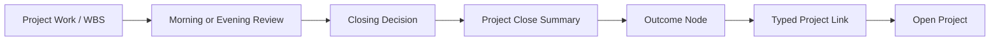

# MissionC Closing Outcome Model

MissionC should treat closing as a meaningful product act, not as a checkbox.
A closed project should leave a result that can be understood, reused, and
connected to future work.

This document narrows the first implementation model for:

- closing decisions,
- project close summaries,
- outcome records,
- cross-project links.

It is intentionally lightweight. The first version should work with simple
records, markdown evidence, and the existing project detail/review flow before
introducing any graph database or accounting integration.

## 1. Core Decision

Do not overload raw project status with every philosophical state.

MissionC should keep two different layers:

| Layer | Purpose | Examples |
|-------|---------|----------|
| Work State | The operational state of a project or item. | planning, active, waiting, review, done, paused, cancelled |
| Closing Decision | The review judgment made when work is evaluated. | done, deferred, cancelled, learned, blocked, carry_over |

The work state answers: "Where is this work operationally?"

The closing decision answers: "What did we decide about this work after
reflection?"

This separation keeps the system flexible. A project can remain operationally
`active` while the evening review records a `carry_over` decision. A project can
become `done` only when the close summary captures enough evidence to make the
result reusable.

## 2. Closing Decisions

| Decision | Meaning | Closes Project? | Expected Follow-up |
|----------|---------|-----------------|--------------------|
| done | Intended outcome was reached. | Yes | Capture outcome, evidence, and reusable result. |
| learned | The main result is insight, validated failure, or a better decision. | Usually yes | Capture lesson and affected future work. |
| cancelled | The work is no longer worth attention. | Yes | Capture cancellation reason and any reusable lesson. |
| deferred | The work is still meaningful, but intentionally postponed. | Usually no | Set review date or successor project. |
| blocked | The work cannot proceed because of a named blocker. | No | Capture blocker, owner, and unblock path. |
| carry_over | The work remains open and moves to the next day or cycle. | No | Set next closing action. |

The first UI should make `done`, `learned`, and `cancelled` true closing paths.
`deferred`, `blocked`, and `carry_over` should remain explicit review decisions
that prevent silent drift.

## 3. Project Close Summary

A project should not be treated as meaningfully closed until it has a close
summary.

Minimum fields:

| Field | Required | Meaning |
|-------|----------|---------|
| project_id | Yes | Source project. |
| closing_decision | Yes | done, learned, cancelled, deferred, blocked, or carry_over. |
| outcome_type | Required for done/learned | deliverable, capability, decision, learning, relationship, operational_improvement, financial_signal. |
| outcome_title | Required for done/learned | Short name for the result. |
| outcome_summary | Yes | What changed because this project existed. |
| evidence_refs | Recommended | Commit, issue, document, test, file, meeting note, or external proof. |
| lessons | Recommended | What should change next time. |
| reusable_assets | Optional | Templates, code, documents, relationships, datasets, decisions, or playbooks. |
| impact_signals | Optional | Time saved, quality improved, risk reduced, cost avoided, revenue enabled, trust increased. |
| linked_open_projects | Optional | Open projects affected by this result. |
| next_action | Required unless closed | The next closing action for deferred, blocked, or carry_over work. |
| reviewed_at | Yes | When the close summary was created or last reviewed. |

The close summary is the bridge between daily reflection and the outcome graph.
It should be short enough to complete during evening review.

## 4. Outcome Record

The smallest useful outcome record is:

```yaml
project_id: 123
closing_decision: done
outcome_type: deliverable
title: "MissionC maintain branch stabilized"
summary: "Core docs and repo identity were aligned around MissionC."
evidence:
  - type: commit
    ref: "52e9899"
impact:
  - type: trust_increased
    note: "Repository and product identity are clearer."
links:
  - type: informs
    target_project: "MissionC closing loop implementation"
```

This is not a required storage format. It defines the semantic minimum the
database or UI should preserve.

## 5. Cross-Project Links

Closed work should be able to affect open work through typed links.

| Link Type | Use When |
|-----------|----------|
| enables | A closed outcome makes an open project possible. |
| reuses | An open project uses an asset or decision from a closed project. |
| depends_on | An open project cannot close without a prior outcome. |
| informs | A lesson or decision changes how an open project should proceed. |
| supersedes | A new project replaces or invalidates an older result. |
| blocks | A result or unresolved blocker prevents another project from closing. |
| contributes_to | An outcome contributes to a higher-level performance or impact result. |

Manual links are enough for the first version. Suggestions can come later after
search and semantic retrieval are stable.

## 6. Closing Flow



This makes the user-facing loop:

1. Work is planned and executed.
2. Review asks what happened.
3. A closing decision is made.
4. The result is summarized.
5. The result becomes reusable context.
6. Future projects can depend on or learn from it.

## 7. Meaningless Structure Guardrails

Closing outcome features must earn their place.

| Structure | It Is Meaningful Only If |
|-----------|--------------------------|
| Closing decision | It changes the next action, project state, or future review. |
| Close summary | It preserves a result, lesson, evidence, or next decision. |
| Outcome type | It helps the user understand what kind of value was created. |
| Project link | It changes how another project is planned or closed. |
| Impact signal | It supports a later decision or performance review. |

If a field does not influence future action, learning, trust, or evidence, it
should stay out of the first implementation.

## 8. Recommended First Implementation Slice

Build the smallest path that changes behavior:

1. Add project close summary fields to project detail or evening review.
2. Require a short close summary before marking a project as meaningfully done.
3. Allow one evidence reference and one optional linked open project.
4. Show the latest close summary on the project detail page.
5. Show linked prior outcomes inside WBS or project detail.

Avoid for now:

- graph database,
- accounting sync,
- automatic semantic linking,
- complex impact scoring,
- large dashboard redesign.

## 9. Open Questions

| ID | Question | Default Assumption |
|----|----------|--------------------|
| OQ-COM-01 | Should `learned` close a project even when no deliverable exists? | Yes, if the lesson is explicit. |
| OQ-COM-02 | Should `blocked` be a closing outcome or non-closing state? | Non-closing review decision. |
| OQ-COM-03 | Should `deferred` close the current project or keep it open? | Keep open unless a successor project is created. |
| OQ-COM-04 | Should every `done` project require an outcome record? | Yes, but the record should be short. |
| OQ-COM-05 | Should project links be manual first? | Yes. |
