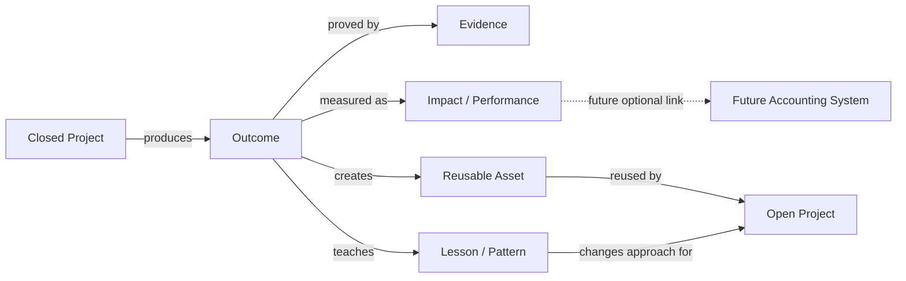
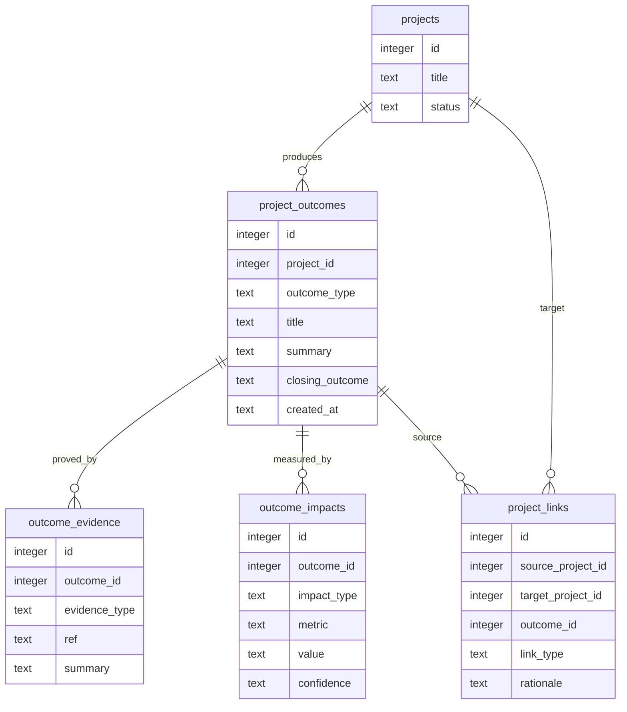
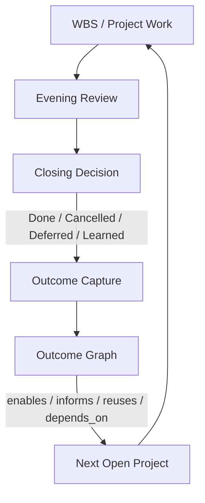
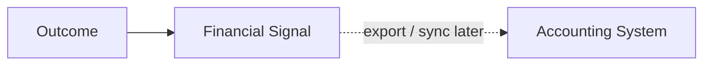

# MissionC Outcome Graph

MissionC should not stop at closing. A closed project should leave an outcome,
and that outcome should be reusable by other open projects.

This document extends the closing philosophy:

> Close work, preserve its result, and connect that result to the next useful
> project.

The concrete closing decision and project close summary model is defined in
`Doc/CLOSING_OUTCOME_MODEL.md`.

Accounting integration is intentionally out of scope for now. However, the
model should be compatible with future accounting or performance systems by
separating outcomes, value evidence, cost evidence, and project links.

## 1. Why Outcome Graph Exists

Closing without an outcome is only cleanup.

MissionC should help answer:

- What was completed?
- What result did it create?
- What evidence proves the result?
- Which open project can reuse or depend on this result?
- Did the work create knowledge, a deliverable, a relationship, a capability, or revenue/cost impact?
- What should be carried forward into the next project cycle?

## 2. Outcome Graph Overview

The key is that a closed project becomes a source node, not a dead node.

## 3. Core Concepts

| Concept | Definition | Examples |
|---------|------------|----------|
| Closed Project | A project that reached a clear closing outcome. | Done, Cancelled, Deferred, Learned |
| Outcome | The concrete result left by the project. | Delivered report, working feature, signed agreement, validated learning |
| Evidence | Proof that the outcome exists. | Commit, release note, document, file, issue, meeting note, test result |
| Impact | A meaningful effect of the outcome. | Time saved, risk reduced, quality improved, cost avoided, trust increased |
| Reusable Asset | Something another project can directly use. | Template, dataset, component, playbook, relationship, decision |
| Lesson | A pattern or mistake that should change future work. | Scope was too large, review came too late, integration was fragile |
| Project Link | A typed edge from one project/outcome to another project. | depends_on, enables, reuses, supersedes, blocks, informs |

## 4. Project Link Types

| Link Type | Meaning | Direction |
|-----------|---------|-----------|
| enables | Closed project made the open project possible. | closed -> open |
| reuses | Open project uses an asset from the closed project. | open -> outcome/asset |
| depends_on | Open project cannot close without the prior outcome. | open -> closed |
| informs | Lesson from closed project changes how open project should proceed. | closed -> open |
| supersedes | New project replaces or invalidates the older result. | open -> closed |
| blocks | A closed/deferred/cancelled result reveals a blocker for another project. | source -> affected |
| contributes_to | Outcome contributes to a higher-level goal or performance result. | outcome -> impact |

## 5. Outcome Types

| Outcome Type | Description | Closing Value |
|--------------|-------------|---------------|
| Deliverable | A concrete artifact was produced. | Useful for clients, reports, deployment, handoff |
| Capability | A reusable ability was created. | Makes future projects faster or possible |
| Decision | A judgment was made and can guide future work. | Reduces ambiguity |
| Learning | A pattern, failure, or insight was captured. | Improves future planning |
| Relationship | A person or organization connection was advanced. | Helps coordination, sales, support, trust |
| Operational Improvement | A workflow became more reliable. | Reduces repeat friction |
| Financial Signal | Revenue, cost, budget, invoice, or avoided cost signal. | Future accounting integration candidate |

## 6. Minimum Data Model

This is a conceptual model, not an immediate migration plan.

## 7. How It Fits The Closing Loop

Closing should ask for the smallest useful outcome record:

1. What result was created?
2. What proves it?
3. What should reuse it?
4. What lesson should change future work?

## 8. Future Accounting Compatibility

MissionC does not need accounting integration now. But the outcome graph should
avoid blocking it later.

Future accounting systems usually care about:

- client / organization,
- project or work package,
- deliverable,
- cost,
- revenue,
- invoice or payment state,
- budget variance,
- time and labor evidence.

MissionC can prepare by keeping financial signals as optional impact records,
not by becoming an accounting system.

Recommended future edge:

This keeps the current craft focused while leaving a clean integration seam.

## 9. Meaningless Structure Test For Outcome Features

Outcome features must not become decorative reporting.

| Proposed Feature | Must Prove |
|------------------|------------|
| Outcome form | It helps future projects reuse, avoid mistakes, or prove performance. |
| Impact metric | It is useful for decisions, not vanity reporting. |
| Project link | It changes how an open project is understood or executed. |
| Asset library | It saves future work or preserves real evidence. |
| Accounting export | It maps to a real accounting need, not speculative complexity. |

## 10. Recommended First Slice

Start lightweight.

Do not build accounting. Do not build a graph database.

First useful slice:

1. Implement the close summary model from `Doc/CLOSING_OUTCOME_MODEL.md`.
2. Define outcome types and project link types in Master Spec.
3. Let closed projects record one outcome and one evidence reference.
4. Let an open project link to a closed project's outcome as `reuses`,
   `depends_on`, or `informs`.
5. Show linked prior outcomes in project detail or WBS.

## 11. Open Questions

1. Should outcomes be captured only when a project closes, or also at milestone/stage completion?
2. Should `Learned` create an outcome automatically, even when the project is cancelled?
3. Should project links be manually curated first, or suggested by search/AI later?
4. What is the minimum useful impact vocabulary: time saved, cost avoided, quality improved, revenue enabled, risk reduced?
5. Should future accounting integration start from outcomes, projects, or organizations?
