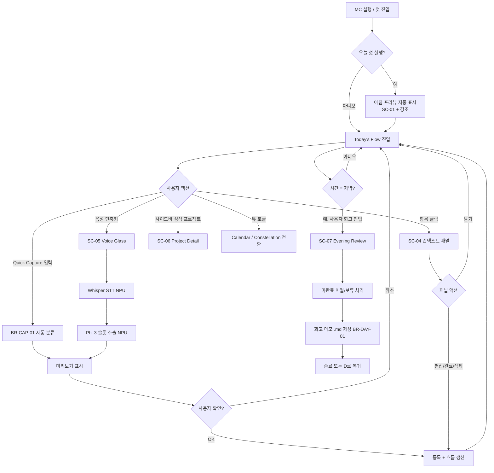
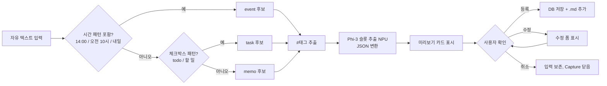
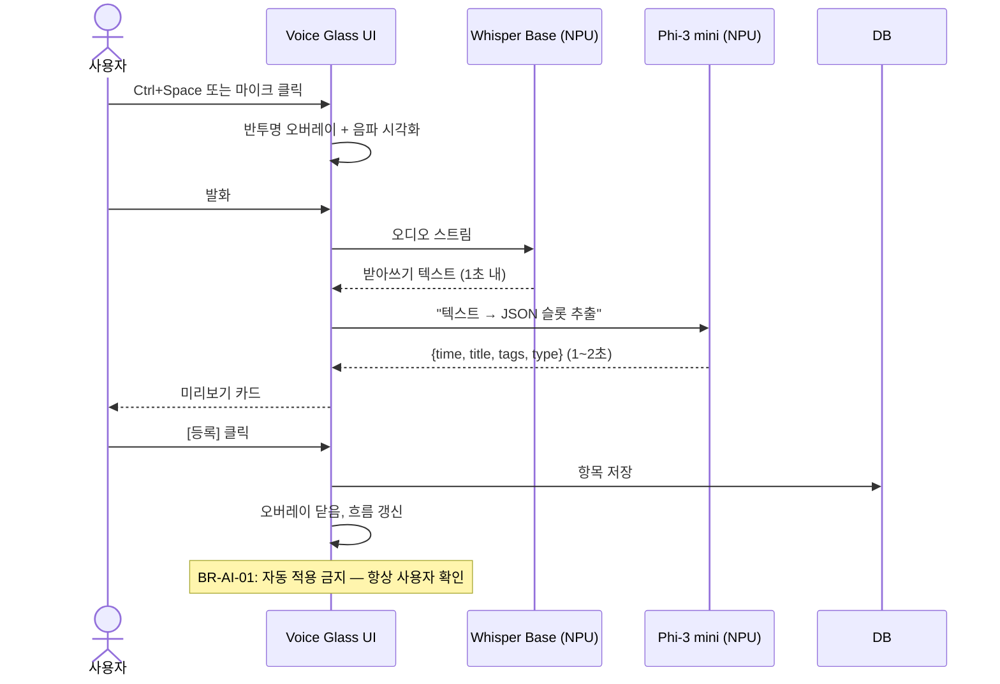
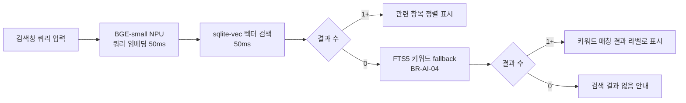
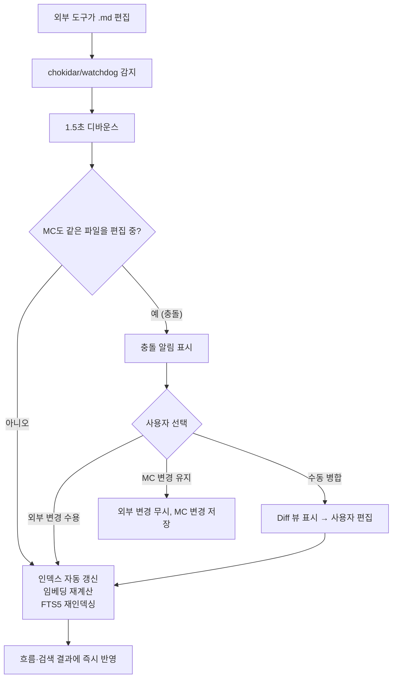
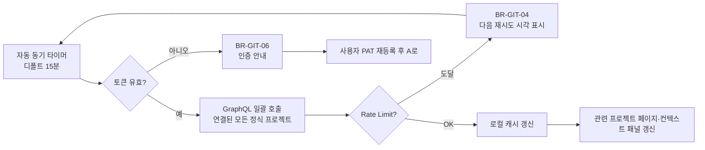
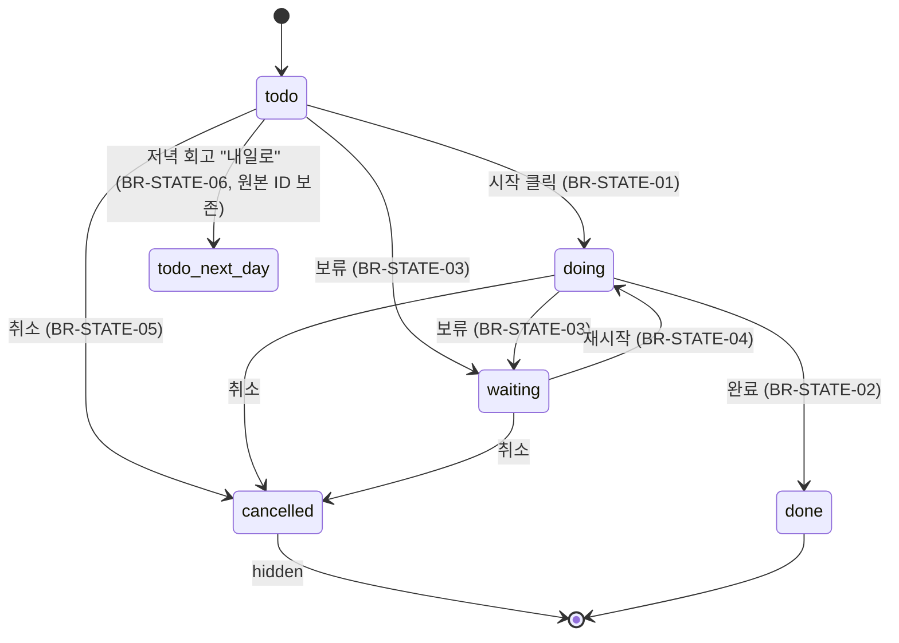
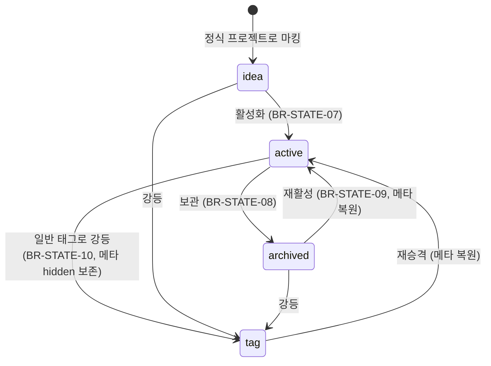
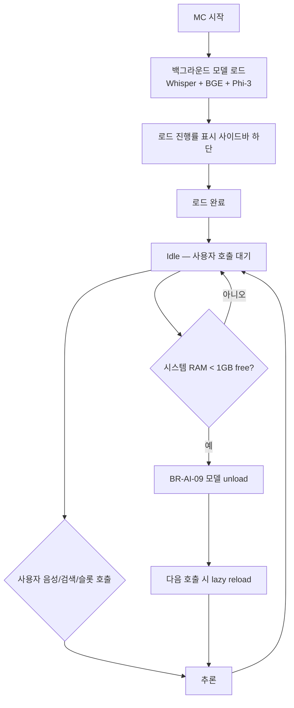

# 흐름 다이어그램 (Flow Diagrams) — MC

> 관련: [02_Feature.md](./02_Feature.md), [03_Business_Rules.md](./03_Business_Rules.md), [04_Screen_Spec.md](./04_Screen_Spec.md)
> 작성: 2026-04-26
> 상태: **Draft — [추론] 기반. iet03 검토 후 Confirmed**

---

## 1. 일일 사용 흐름 (Master Flow)

---

## 2. Quick Capture 자동 분류 흐름 (FR-CAP-01)

---

## 3. 음성 입력 흐름 (FR-AI-VOICE + UX-04)

---

## 4. 의미 검색 흐름 (FR-AI-SEARCH)

---

## 5. 외부 .md 변경 감지·반영 흐름 (BR-MEMO-02, BR-MEMO-07)

---

## 6. Git 이슈 동기 흐름 (FR-GIT-03·04)

---

## 7. 태스크 상태 전이

---

## 8. 정식 프로젝트 상태 전이

---

## 9. AI 모델 로드·언로드 라이프사이클 (BR-AI-08·09)

---

## Open Questions

| OQ-ID | 질문 | 기한 |
|-------|------|------|
| OQ-04-04 | 음성 입력 중 발화 끝 자동 감지(VAD) 방식 vs Push-to-Talk(누른 동안만) | Phase 4 |
| OQ-04-05 | Quick Capture 자동 분류가 모호할 때 (BR-CAP의 분기가 둘 다 해당) 디폴트 우선순위 — 일정 > 태스크 > 메모? | Step 5 |
| OQ-04-06 | 외부 .md 충돌 시 디폴트 (BR-MEMO-07) — 묻기 vs 외부 우선 vs MC 우선 | Step 5 |

---

## 다음

→ Step 5 ([05_Gap_Analysis.md](./05_Gap_Analysis.md)): 비판적 갭 분석 — 누락 기능, 리스크, 새 아이디어.
