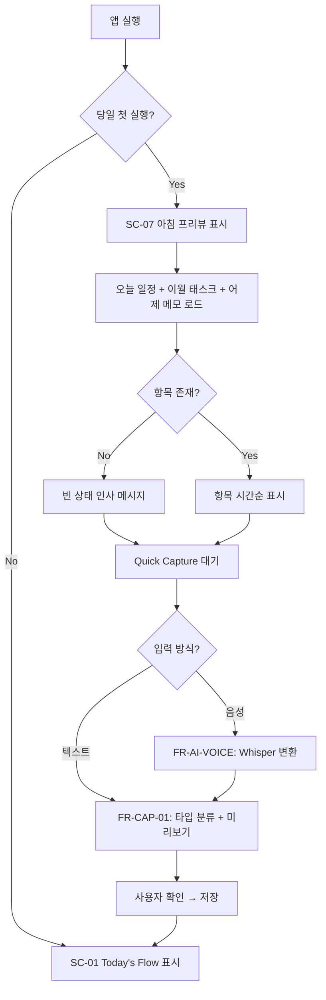
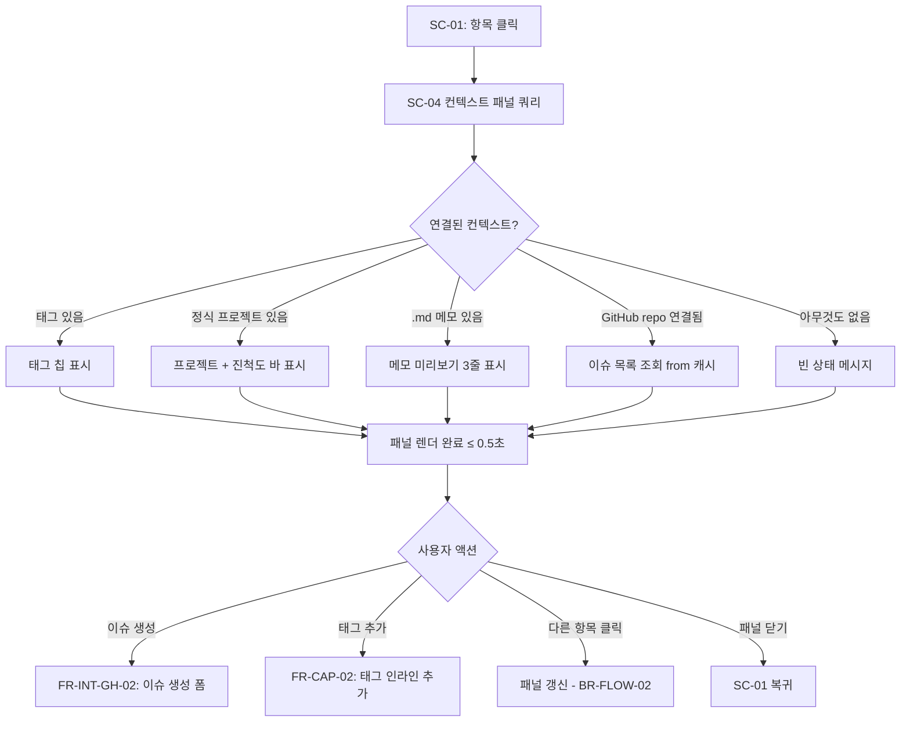
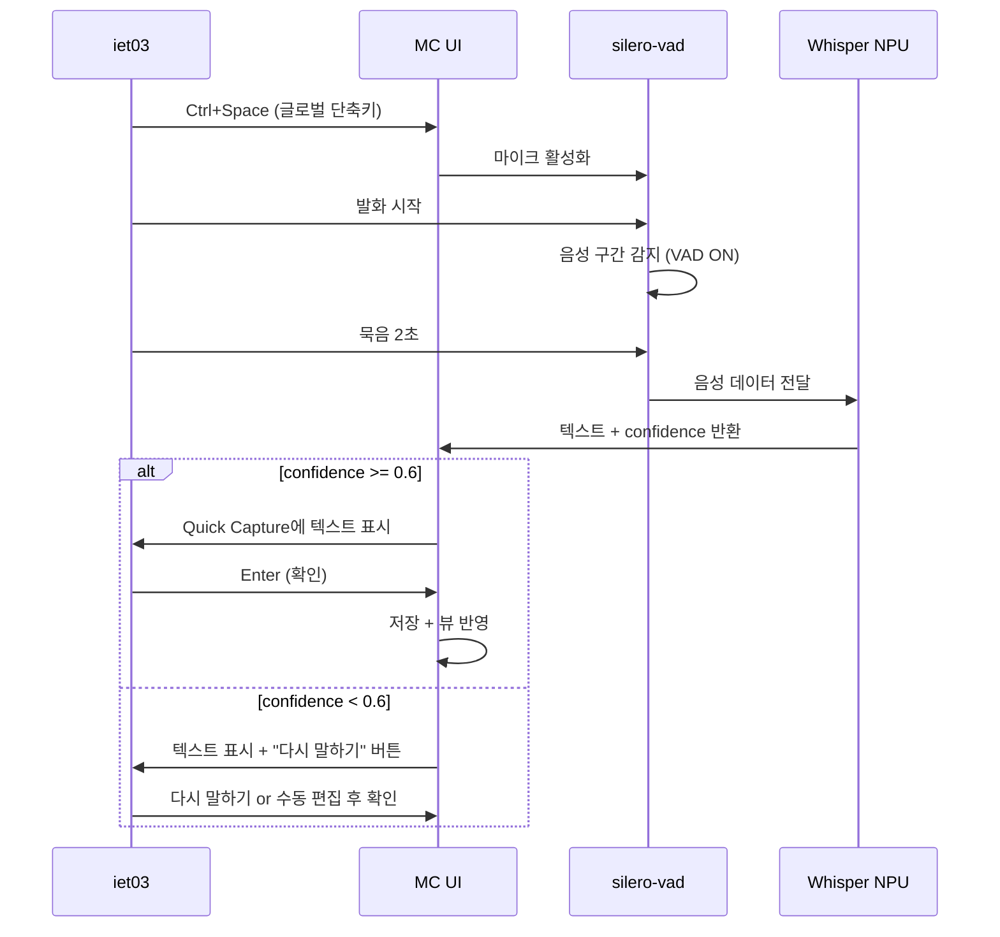
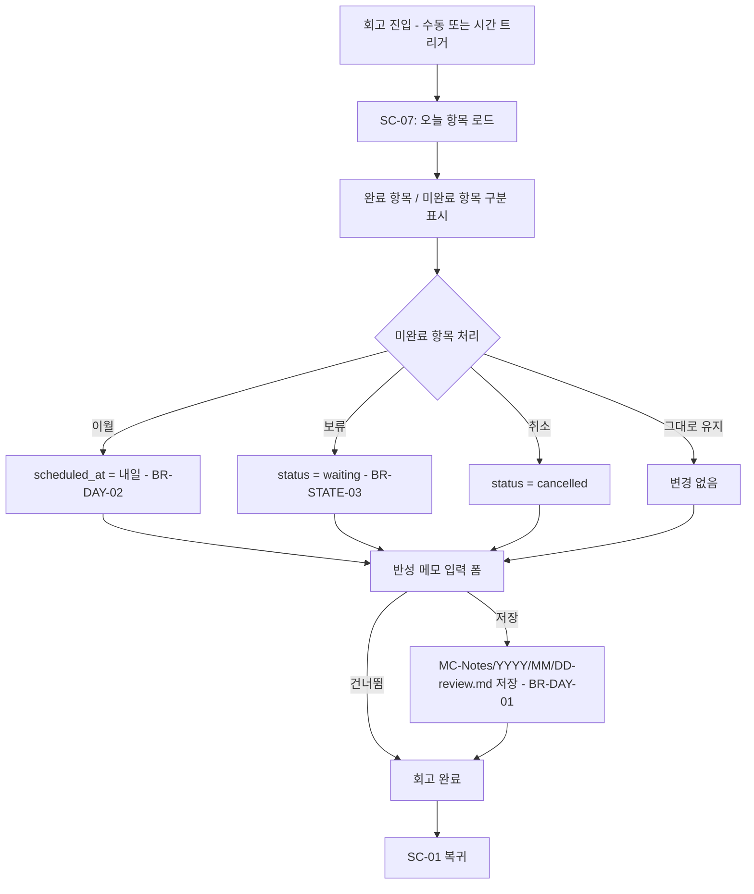
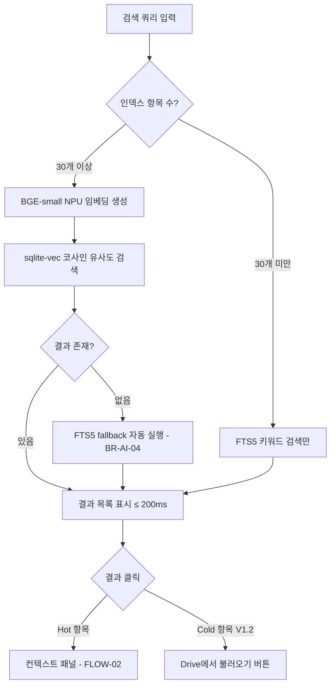
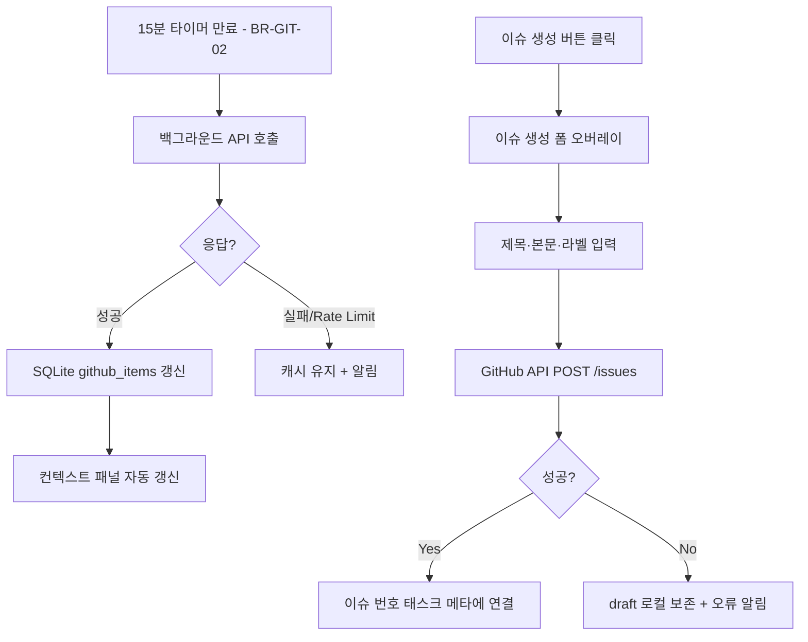
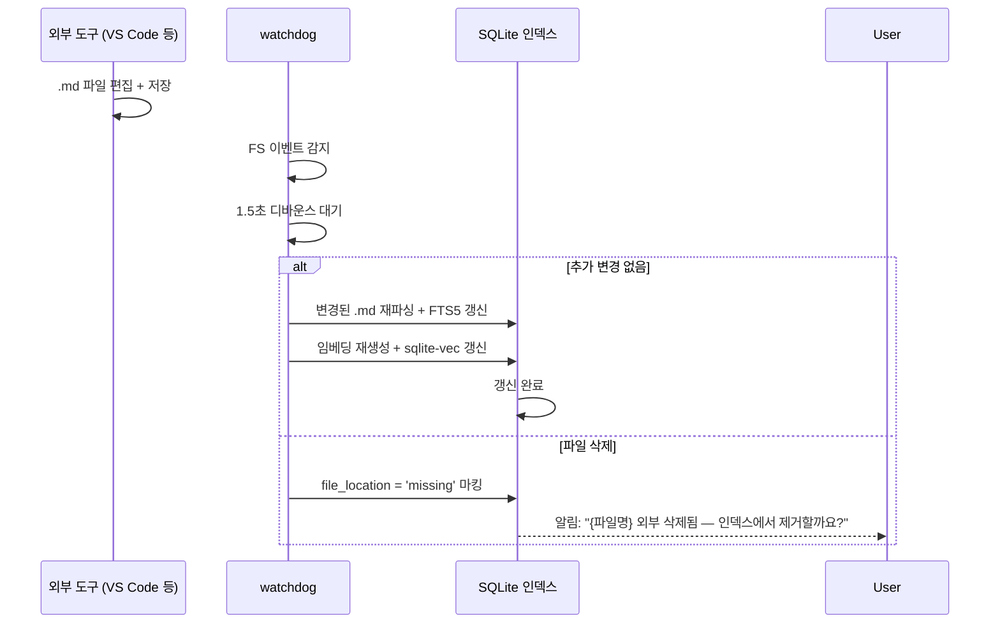
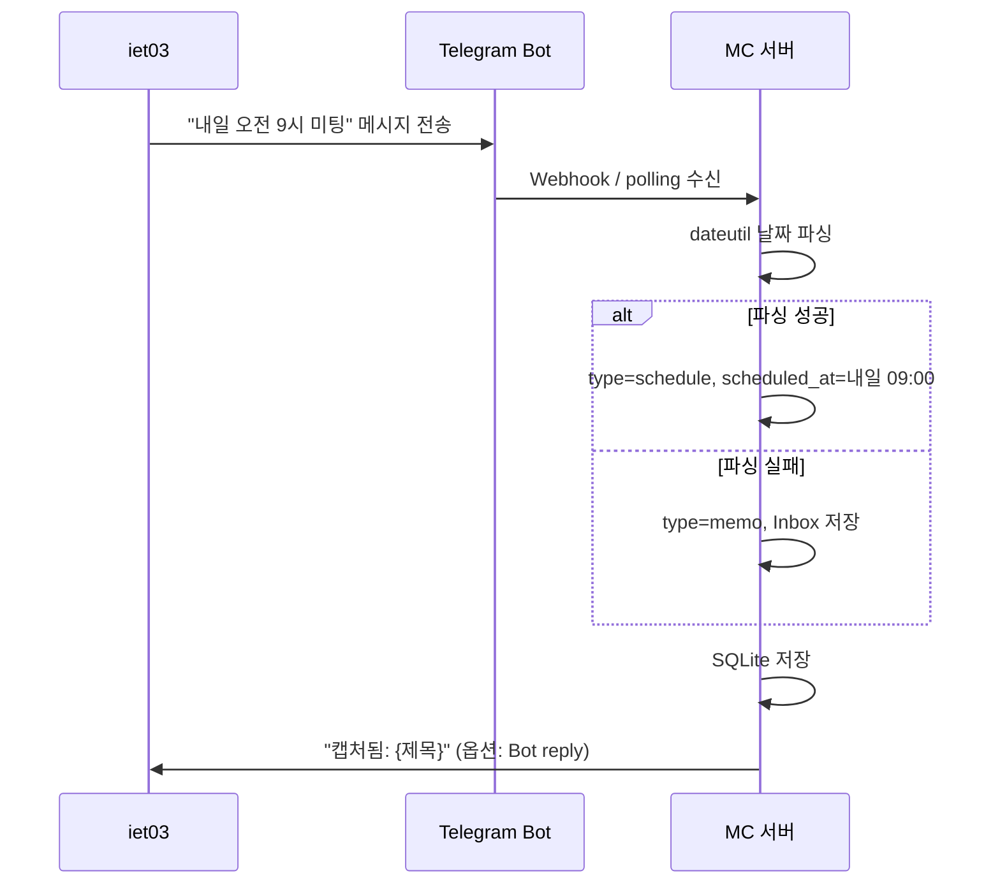

# 유저 플로우 — MC

> 인풋: [04_Flow.md](../phase1_interview/04_Flow.md) (Phase 1 Mermaid 9종 기반 확장)
> 작성: 2026-04-27 | BA Writer v1.0
> 대상 페르소나: P-01 (iet03)

---

## FLOW-01: 아침 루틴 (Morning Routine)

**관련 FR**: FR-DAY-01, FR-FLOW-01, FR-CAP-01, FR-AI-VOICE

| 단계 | 화면 | 사용자 행동 | 시스템 응답 | 적용 BR |
|------|------|-----------|-----------|--------|
| 1 | SC-01 | 앱 실행 | 당일 첫 실행 판단 | — |
| 2 | SC-07 | 프리뷰 확인 | 오늘 일정·이월 태스크·어제 메모 표시 | BR-DAY-04 |
| 3 | SC-01 | Quick Capture 입력 | 타입 분류 미리보기 | BR-CAP-01~04 |
| 4 | SC-01 | Enter 확인 | 저장 + 뷰 반영 | BR-AI-01 |

---

## FLOW-02: 항목 클릭 → 컨텍스트 패널 (Context Assembly)

**관련 FR**: FR-FLOW-03, FR-GIT-03
**MC 핵심 차별화 플로우**

| 단계 | 화면 | 사용자 행동 | 시스템 응답 | 시간 목표 |
|------|------|-----------|-----------|---------|
| 1 | SC-01 | 항목 클릭 | 컨텍스트 쿼리 시작 | — |
| 2 | SC-04 | 패널 열림 확인 | 태그·메모·이슈 동시 로드 | ≤ 0.5초 |
| 3 | SC-04 | 이슈 생성 버튼 클릭 | 이슈 생성 폼 오버레이 | — |

---

## FLOW-03: 음성 캡처 → 저장 (Voice Capture)

**관련 FR**: FR-AI-VOICE, FR-CAP-01

---

## FLOW-04: 저녁 회고 (Evening Review)

**관련 FR**: FR-DAY-02, FR-DAY-03, FR-MEMO-01

---

## FLOW-05: 의미 검색 (Semantic Search)

**관련 FR**: FR-AI-SEARCH

---

## FLOW-06: GitHub 이슈 동기 + 생성

**관련 FR**: FR-GIT-03, FR-GIT-04, FR-INT-GH-02

---

## FLOW-07: 외부 .md 편집 감지 → 인덱스 갱신

**관련 FR**: FR-MEMO-04

---

## FLOW-08: Telegram → MC 빠른 캡처

**관련 FR**: FR-INT-TG-01

---

## 예외 흐름 요약

| 예외 상황 | 발생 플로우 | 처리 | 복귀 지점 |
|---------|---------|------|---------|
| DB 읽기 실패 | FLOW-01, 02 | 마지막 캐시 표시 + 재시도 버튼 | 정상 시 자동 복귀 |
| 음성 인식 실패 | FLOW-03 | 텍스트 입력 fallback + 안내 | QC 텍스트 입력 |
| GitHub API 실패 | FLOW-06 | 캐시 유지 + 알림 | 다음 동기 주기 |
| 파일 충돌 | FLOW-07 | 3옵션 다이얼로그 (BR-MEMO-07) | 사용자 선택 후 |
| 네트워크 단절 (TG) | FLOW-08 | 재시도 큐 → 복구 시 처리 | 자동 |

---

## Change Log

| 버전 | 날짜 | 변경 내용 | 변경자 |
|------|------|----------|--------|
| 1.0 | 2026-04-27 | Phase 1 Flow 기반 BA 형식화 + 4개 신규 플로우 추가 | BA Writer v1.0 |
