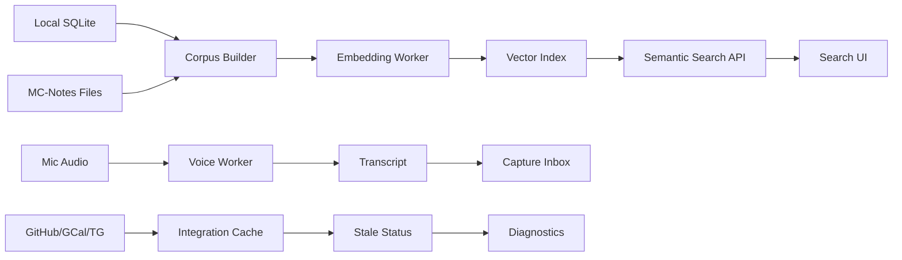

# RnD Architecture and Experiment Plan

## 1. 목적

MC의 AI/RnD 기능을 “좋아 보이는 기능”이 아니라 측정 가능한 실험으로 분리한다. 각 실험은 제품 편입 기준, 실패 기준, fallback을 가져야 하며, 기존 core workflow를 불안정하게 만들면 안 된다.

## 2. RnD Architecture



## 3. Experiment Tracks

| Track | 연결 FR | 실험 질문 | Pass 기준 | Fail 기준 | Fallback |
|-------|---------|-----------|-----------|-----------|----------|
| RND-SEARCH | FR-RND-01 | 로컬 의미 검색이 실제 업무 회수에 유효한가? | top-5 hit >= 80%, P95 <= 800ms | hit < 65% 또는 P95 > 1200ms | FTS5 |
| RND-VOICE | FR-RND-02 | 음성 capture가 빠른 메모 입력으로 쓸 만한가? | P95 <= 3s, review-needed rate <= 30% | P95 > 5s 또는 빈 transcript > 10% | text quick capture |
| RND-TAG | FR-RND-03 | 태그 추천이 수동 분류를 줄이는가? | accepted suggestion >= 50% | accepted < 25% | manual tags |
| RND-SYNC | FR-RND-04 | on-demand sync를 cache/stale 모델로 바꿀 가치가 있는가? | page load P95 개선 >= 20% | 개선 < 5% | current on-demand |

## 4. Technical Design by Track

### 4.1 Semantic Search

| 항목 | 설계 |
|------|------|
| Corpus | items.title/body, file_index linked markdown, project metadata |
| Index key | source_type, source_id, content_hash, embedding_model |
| Refresh | content hash changed or manual rebuild |
| API | `GET /search?mode=semantic&q=...` 또는 `/api/search/semantic` |
| Storage option | SQLite table for metadata + local binary/vector store, final decision after prototype |

### 4.2 Voice Capture

| 항목 | 설계 |
|------|------|
| Input | browser upload or local tray capture, wav/webm |
| Worker | local STT process, model status endpoint |
| Output | capture_inbox row with source=voice |
| UX | transcript preview, accept/edit/reject |

### 4.3 Tag Suggestion

| 항목 | 설계 |
|------|------|
| Input | item title/body, existing tags, label context |
| Method | similarity to tag centroids or lightweight classifier |
| Output | suggested_tags JSON or UI chips |
| Guardrail | never auto-apply destructive taxonomy changes |

### 4.4 Sync Hardening

| 항목 | 설계 |
|------|------|
| GCal/GitHub | page renders cache first, refresh button or stale threshold triggers background refresh |
| Telegram | persist offset in settings or integration_state table |
| Diagnostics | last_success_at, last_error, stale_for, next_retry_at |
| Retry | failed external calls write retry_queue only when user-visible value exists |

## 5. Proposed Schema Additions

```sql
CREATE TABLE IF NOT EXISTS rnd_experiments (
    id              INTEGER PRIMARY KEY AUTOINCREMENT,
    track           TEXT NOT NULL,
    hypothesis_id   TEXT NOT NULL,
    status          TEXT NOT NULL CHECK(status IN ('draft','running','passed','failed','paused')),
    metric_json     TEXT,
    started_at      TEXT,
    completed_at    TEXT
);

CREATE TABLE IF NOT EXISTS integration_state (
    service         TEXT PRIMARY KEY,
    last_success_at TEXT,
    last_error      TEXT,
    cursor          TEXT,
    stale_after_sec INTEGER NOT NULL DEFAULT 1800,
    updated_at      TEXT NOT NULL DEFAULT (strftime('%Y-%m-%dT%H:%M:%fZ','now'))
);
```

## 6. Test Strategy

| 테스트 | 목적 | 도구 |
|--------|------|------|
| Unit | scoring, threshold, fallback | pytest |
| Integration | search/voice/inbox DB path | FastAPI TestClient |
| Performance | P95 latency | pytest-benchmark or custom timer |
| Restart simulation | Telegram cursor persistence | pytest temp DB |
| Security review | secrets/logs/plaintext checks | static grep + code review |

## 7. RnD Gate

| Gate | 조건 |
|------|------|
| Gate A - Experiment Ready | dataset, metric, fallback, owner defined |
| Gate B - Prototype Ready | local run command, temp DB test, no secret leakage |
| Gate C - Product Candidate | pass metrics met twice, UX reviewed, docs updated |
| Gate D - Productized | tests added, diagnostics added, rollback path exists |

## 8. Near-term Implementation Backlog

| ID | 작업 | 연결 |
|----|------|------|
| TB-RND-01 | semantic search gold set format 정의 | FR-RND-01 |
| TB-RND-02 | embedding index prototype | FR-RND-01 |
| TB-RND-03 | voice sample harness | FR-RND-02 |
| TB-RND-04 | integration_state migration | FR-RND-04 |
| TB-RND-05 | Telegram offset persistence | HYP-RND-04 |

