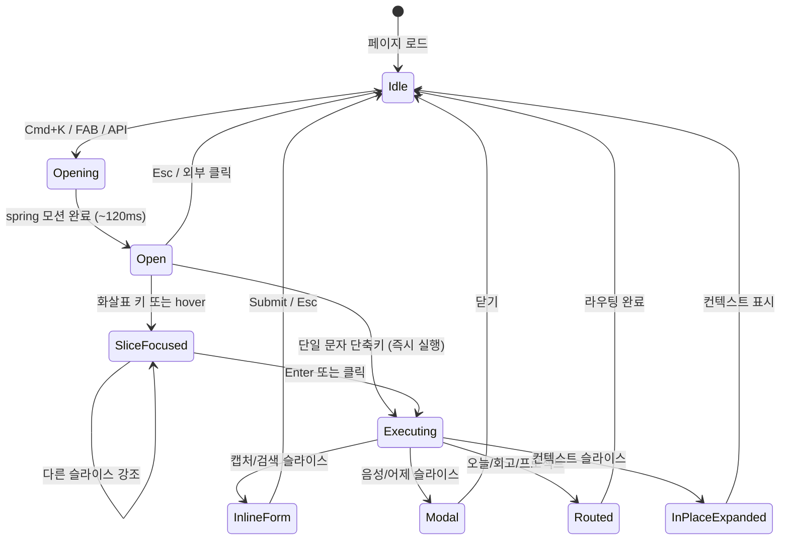

# Screen Spec — Radial Command Palette

> **화면 ID**: SC-RADIAL | **버전**: V1.5 | **연관 FR**: FR-RADIAL-01~05
> **AI_SDLC 글로벌 규칙**: ASCII 목업 (Mermaid 는 인터랙션 흐름에 사용)

---

## 1. 화면 진입점

| 진입 트리거 | 위치 | 결과 |
|------------|------|------|
| `Cmd+K` / `Ctrl+K` / `/` | 모든 페이지 (base.html) | Radial 표시 |
| 우하단 ⊙ FAB | 모든 페이지 (base.html) | Radial 표시 |
| `window.openRadial(opts?)` | JavaScript API | Radial 표시 (다른 컴포넌트에서 호출) |

---

## 2. 메인 ASCII 목업 — 닫힘 상태

```
┌────────────────────────────────────────────────────────────┐
│  MC                              [Today]  [Calendar]  ...  │  ← 기존 topbar
├────────────────────────────────────────────────────────────┤
│                                                            │
│   기존 페이지 내용 (Today's Flow / Project / Inbox 등)      │
│                                                            │
│                                                            │
│                                                  ┌──┐      │
│                                                  │ ⊙│ FAB  │  ← 우하단
│                                                  └──┘      │
└────────────────────────────────────────────────────────────┘
```

- FAB: 56×56 px 원형, `position: fixed; bottom: 24px; right: 24px;`
- 클릭 또는 `Cmd+K` 로 진입

---

## 3. 메인 ASCII 목업 — 열림 상태 (기본)

```
┌────────────────────────────────────────────────────────────┐
│  ░░░░░░░░░░░░░░░░░░░░░░░░░░░░░░░░░░░░░░░░░░░░░░░░░░░░░░░░░  │
│  ░░░░░░░░░░░░░░░░░ blur(20px) 오버레이 ░░░░░░░░░░░░░░░░░░░  │
│  ░░░░░░░░░░░░░░░░░░░░░░░░░░░░░░░░░░░░░░░░░░░░░░░░░░░░░░░░░  │
│  ░░░░░░░░░░░░░░░░         📥 캡처         ░░░░░░░░░░░░░░░  │
│  ░░░░░░░░░░░░░╱──────────────────────────╲░░░░░░░░░░░░░░░  │
│  ░░░░░░░░░╱  음성        ↑              검색  ╲░░░░░░░░░░░  │
│  ░░░░░░  10.5            (12)            1.5    ░░░░░░░░░  │
│  ░░░░╱                                            ╲░░░░░░  │
│  ░░╱  9                ┌────────┐                3   ╲░░░  │
│  ░░  프로젝트 ←        │  캡처  │        →   오늘    ░░  │  ← 강조 시
│  ░░╲                   │ (대형) │                    ╱░░  │     중앙 라벨
│  ░░░╲                  └────────┘                  ╱░░░░░  │
│  ░░░░░╲   7.5              6                4.5  ╱░░░░░░░  │
│  ░░░░░░░  어제           ↓               컨텍스트 ░░░░░░░  │
│  ░░░░░░░░░╲   회고                                ╱░░░░░░  │
│  ░░░░░░░░░░░╲────────────────────────────────────╱░░░░░░░  │
│  ░░░░░░░░░░░░░░░░░░░░░░░░░░░░░░░░░░░░░░░░░░░░░░░░░░░░░░░░░  │
│  ░░░░░░░░░░░  Esc 닫기 · ↑↓←→ 강조 · Enter 실행  ░░░░░░░░░  │
└────────────────────────────────────────────────────────────┘
```

### 치수 사양
- 외부 원: ⌀ 480 px (반응형: viewport 가 작으면 ⌀ 80vmin)
- 내부 hub 원: ⌀ 160 px (중앙 라벨 영역)
- 슬라이스: 외부 - 내부 도넛, 8 등분 (각 45°)
- 위치: viewport 정중앙 (`fixed; top: 50%; left: 50%; transform: translate(-50%, -50%)`)

---

## 4. 슬라이스 8개 — 위치·심볼·라벨·액션

| 시각 | 각도 | 심볼 | 라벨 | 단축키 | 액션 패턴 | 액션 |
|------|------|------|------|--------|----------|------|
| 12  | -90° | 📥 | 캡처 | `↑` `c` | Inline form | radial 안에 input 표시 → POST /api/items |
| 1.5 | -45° | 🔍 | 검색 | `↗` `s` | Inline form | radial 안에 검색바 → GET /api/cmdk |
| 3   | 0°   | 📅 | 오늘 | `→` `t` | Direct route | 라우팅 `/` |
| 4.5 | 45°  | 🪟 | 컨텍스트 | `↘` `x` | In-place expand | 현재 페이지의 컨텍스트 패널 토글 |
| 6   | 90°  | 🌙 | 회고 | `↓` `r` | Direct route | 시간대 따라 `/morning` 또는 `/evening` |
| 7.5 | 135° | 🕘 | 어제 | `↙` `y` | Modal | 어제 활동 5개 카드 모달 |
| 9   | 180° | 🗂 | 프로젝트 | `←` `p` | Direct route | `/hierarchy` (또는 컨텍스트 따라 `/project/{id}`) |
| 10.5| -135°| 🎙 | 음성 | `↖` `v` | Modal | Whisper STT 모달 (FR-AI-VOICE 재사용) |

---

## 5. 인터랙션 상태

### 5.1 상태 다이어그램



### 5.2 상태별 시각 사양

| 상태 | 슬라이스 배경 | 슬라이스 라벨 | 중앙 hub |
|------|---------------|---------------|----------|
| Idle (닫힘) | — | — | — (radial 미표시) |
| Open (강조 없음) | `oklch(98% 0.005 270 / 0.8)` 글래스 | 회색 (`var(--muted)`) | "Cmd+K 메뉴" 옅게 |
| SliceFocused | 강조 슬라이스만 `oklch(58% 0.18 280 / 0.18)` 글로우 | 강조 슬라이스 라벨 brand color | 강조 라벨 대형 (24px) |
| Executing — InlineForm | radial 외곽 유지, 중앙 hub 가 input 으로 변환 | 페이드 아웃 | input 활성 |

### 5.3 모션 사양

| 모션 | API | 파라미터 |
|------|-----|----------|
| 진입 | Web Animations API | spring(stiffness: 380, damping: 28), 슬라이스 stagger 12ms |
| 슬라이스 강조 | CSS transition | `filter`, `transform` 80ms ease-out |
| 종료 | Web Animations API | scale(0.95) + opacity 0, 100ms ease-out |
| InlineForm 변환 | Web Animations API | morph 200ms cubic-bezier(0.4, 0, 0.2, 1) |

ADR-002 Layer 3 (Motion / Spatial) 의 Web Animations API 활용 사례.

---

## 6. 키 맵 — 우선순위 표

| 키 입력 | Open 상태 | InlineForm 상태 | 우선순위 |
|---------|-----------|-----------------|----------|
| `Cmd+K` / `Ctrl+K` | 닫기 (토글) | 닫기 | 1 (capture) |
| `Esc` | 닫기 | InlineForm 취소 → Open | 1 (capture) |
| `↑↓←→↗↘↙↖` | 슬라이스 강조 | (입력으로 통과) | 2 |
| `c/s/t/x/r/y/p/v` | 슬라이스 즉시 실행 | (입력으로 통과) | 2 |
| `Enter` | 강조 슬라이스 실행 | InlineForm 제출 | 3 |
| `Tab` | 다음 슬라이스 (선형) | InlineForm 내부 | 3 |
| `/` | (Cmd+K 와 동일) | (입력으로 통과) | 2 |

**capture phase listener** 사용 (다른 페이지 키 핸들러보다 먼저 가로챔). 단, `<input>`/`<textarea>` 포커스 중에는 `Cmd+K` 와 `Esc` 만 작동.

---

## 7. 컨텍스트 인지 동적 변형 (FR-RADIAL-03)

| 현재 페이지 URL | 캡처 슬라이스 | 컨텍스트 슬라이스 | 프로젝트 슬라이스 |
|-----------------|---------------|-------------------|-------------------|
| `/` (Today) | 일반 캡처 | 비활성 (gray) | `/hierarchy` |
| `/project/{id}` | 해당 프로젝트로 자동 연결 | 활성 (현재 항목 패널) | `/hierarchy` |
| `/inbox` | "분류로 점프" 라벨로 변경 | 비활성 | `/hierarchy` |
| `/calendar` | 시각 정보 포함 캡처 | 비활성 | `/hierarchy` |
| `/morning` `/evening` | 회고 메모 | 비활성 | `/hierarchy` |
| 기타 | 일반 캡처 | 비활성 | `/hierarchy` |

라벨 변경 외 슬라이스 위치/심볼은 항상 동일 (공간 메모리 유지).

---

## 8. 모바일·작은 화면 대응

- viewport ≤ 600 px: 외부 원 ⌀ 80vmin, 라벨 폰트 12 px
- 모바일 키보드 부재 → 슬라이스 *탭* 으로 액션 (≥ 36 px touch target)
- viewport ≤ 480 px: radial 미표시, FAB 만 작동 → 표준 cmdk fallback (V1.6 검토)

---

## 9. 접근성

| 항목 | 요구사항 |
|------|----------|
| 키보드 도달 | 모든 슬라이스 100% 도달 가능 |
| ARIA | `role="menu"` + 각 슬라이스 `role="menuitem"` |
| Focus visible | 강조 슬라이스에 outline 2px brand color |
| Screen reader | 슬라이스 라벨 + 단축키 announce (`aria-label="캡처, c 키"`) |
| Reduced motion | `prefers-reduced-motion` 시 스프링 모션 → 즉시 페이드 |
| 색상 대비 | WCAG AA 준수 (라벨 텍스트 ≥ 4.5:1) |

---

## 10. 연관 화면

- 진입 시: 모든 페이지 (overlay)
- 종료 시: InlineForm/Modal 닫힘 후 원래 페이지로 복귀
- 음성 슬라이스 → SC-VOICE (FR-AI-VOICE 의 기존 모달)
- 컨텍스트 슬라이스 → SC-02 컨텍스트 패널 (V1.0)
